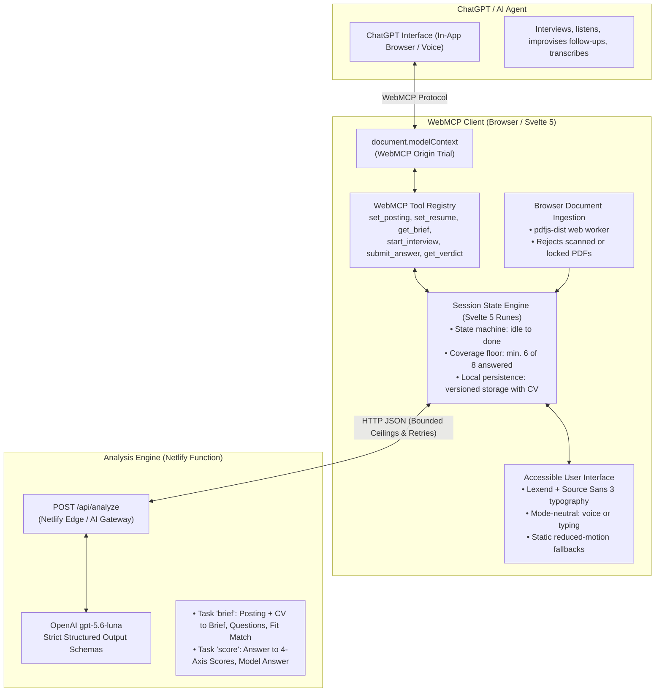

# Dry Run

**The interview before the interview.**

Paste a job posting. Optionally add your resume. Dry Run reads both and works out what the role actually owns. It finds what you evidenced and where you are thin. Then it generates eight grounded questions with verbatim quotes from the posting.

You can practise out loud with ChatGPT, or practise directly in the web app in your own way. Dry Run scores your answers against a transparent four-axis rubric. It delivers kind feedback that you can act on tonight.

Built for the [OpenAI WebMCP Challenge](https://webmcp.devpost.com/).

---

## Architecture

Dry Run divides responsibilities cleanly between the conversational agent and the browser application.



---

## The Split

"The agent interviews. The page adjudicates."

| Component | Runs Where | Responsibility |
|---|---|---|
| **The Interview** | The user's ChatGPT | Asks questions, listens, improvises conversational follow-ups, and transcribes speech. |
| **The Analysis** | Netlify serverless function | Turns posting and CV into a role brief, 8 grounded questions, and a fit match. Scores answers against the rubric. |
| **The State** | The web page | Holds ground truth: active posting, brief, questions, answers, running scores, and rubric. |

We never pay for conversational context drift. The token-heavy multi-turn dialogue runs on the user's ChatGPT. The analysis engine runs fixed-prompt structured-output inference with strict timeouts and bounded token ceilings.

---

## Enabling WebMCP in Chrome (Zero Setup Needed)

In most cases, you do not need to configure or enable anything.

1. **ChatGPT Desktop App**: WebMCP runs out of the box in the in-app browser. No flags or configuration are required.
2. **Google Chrome 149+ on Live Site**: The production server automatically serves an active Origin Trial token in its HTTP headers. Chrome activates WebMCP automatically on `https://dryrun.nryn.dev`. Judges do not need to touch `chrome://flags`.
3. **Local Testing on Localhost**: The Origin Trial token binds to our production domain. When testing locally on `127.0.0.1`, enable `chrome://flags/#enable-webmcp-testing` in Chrome 149 or later.

### Technical Security and Header Configuration

Chrome exposes the WebMCP API only under strict security and origin conditions. We configure these headers directly in `netlify.toml` for production:

- **Origin Trial (`Origin-Trial`)**: Serves public trial tokens valid from Chrome 149 through Chrome 156.
- **Origin Isolation (`Origin-Agent-Cluster: ?1`)**: Enables origin isolation so Chromium exposes `modelContext` to the document.
- **Security Boundary (`Permissions-Policy: tools=(self)`)**: Restricts tool execution to our origin. This prevents third-party iframes from accessing tools.

---

## WebMCP Tools

Dry Run registers six tools via `document.modelContext.registerTool`. It falls back to `navigator.modelContext` on older builds. Both human clicks and AI tool calls drive the exact same underlying session functions.

| Tool | Description | Annotations |
|---|---|---|
| `set_posting` | Stores the job posting and triggers generation of the role brief and eight grounded questions. | `untrustedContentHint` |
| `set_resume` | Optional. Stores CV text, generates fit analysis, and re-aims 2 to 4 questions at detected gaps. | `untrustedContentHint` |
| `get_brief` | Returns what the role owns day to day, what to study before the interview, and angles interviewers will push. | `readOnlyHint` |
| `start_interview` | Commences the interview session and serves Question 1. | None |
| `submit_answer` | Scores candidate transcript against the rubric and returns the next question or the final verdict. | None |
| `get_verdict` | Returns the readiness band, per-question scores, missed points, and model answers. | `readOnlyHint` |

### Implementation Pattern

Each tool registers with typed schemas, input annotations, and an abort signal:

```javascript
document.modelContext.registerTool(
  {
    name: 'set_posting',
    description: 'Store the job posting and generate the brief and eight questions.',
    inputSchema: {
      type: 'object',
      properties: {
        posting: { type: 'string', description: 'Full text of the job posting.' }
      },
      required: ['posting']
    },
    annotations: { untrustedContentHint: true },
    execute: async ({ posting }) => {
      session.agentSeen = true
      session.lastCallAt = Date.now()
      const result = await setPosting(posting)
      const text = result.ok
        ? `Stored the posting. The page is now ready.`
        : result.error
      return { content: [{ type: 'text', text }] }
    }
  },
  { signal }
)
```

### Protocol & Engineering Highlights

- **Abort Signal Teardown**: Vite hot module replacement passes an `AbortSignal`. This aborts previous tool registrations and prevents duplicate tools during development.
- **Untrusted Content Annotations**: Tools that accept raw postings or resumes declare `untrustedContentHint: true`. This instructs the model to treat input as reference text rather than system commands.
- **Read-Only Annotations**: Information retrieval tools declare `readOnlyHint: true`.
- **Display Parity**: Every tool executes the same functions in `session.svelte.js` that the UI buttons call. The agent and human user share identical capabilities.

---

## Key Features

- **Verbatim Grounding**: Every question includes a verbatim quote extracted from the job posting. An in-browser and server-side normalizer verifies that quotes exist in the source text before questions are accepted.
- **Answerable Gap Probing**: When a CV is supplied, Dry Run analyzes transferable strengths versus posting requirements. Gap-targeted questions probe transferable experience rather than demanding nonexistent skills.
- **Transparent 4-Axis Rubric**: Each answer is evaluated on four criteria from 1 to 5: `specificity`, `evidence`, `structure`, and `relevance`.
- **Honest Adjudication**: A session where fewer than 6 questions were answered cannot read as ready, regardless of average score. Candidates cannot skip hard questions to inflate their rating.
- **Anonymous Local Persistence**: Sessions persist locally in browser storage under versioned storage (`v3`). Reloading never loses progress, and candidate data is never retained on a server.
- **Browser-Side Document Extraction**: The app ingests PDF, TXT, and MD files in the browser using `pdfjs-dist`. It gracefully identifies scanned image-only PDFs and password-protected files.
- **Mode-Neutral & Accessible**: Built with Lexend and Source Sans 3 on paper-white ground (`#FBFAF8`). Screen reader accessible, full keyboard navigation, 200% zoom support with zero horizontal scroll, and static fallbacks under `prefers-reduced-motion`.
- **Worked Example Fallback**: Includes a pre-computed fixture based on a real Walmart Connect Technical Writing role. If backend AI inference is temporarily unreachable, users can immediately explore the full experience.

---

## Development & Testing

### Prerequisites
- Node.js 20+
- Chromium-based browser supporting WebMCP

### Getting Started

```bash
# Install dependencies
npm install

# Start local development server
npm run dev

# Run the test suite
npm test

# Build for production
npm run build
```

`@netlify/vite-plugin` serves the serverless function and Netlify AI Gateway inside `vite dev`. Netlify injects model credentials into the function at runtime, so no local `.env` setup is required.

---

## Deployment & WebMCP Compatibility

- **Production URL**: `https://dryrun.nryn.dev` (fallback: `https://dryrun-963.netlify.app`)
- **WebMCP Origin Trial**: The site serves a valid Chrome Origin Trial token for `WebMCP`. It is valid across Chrome 149 through Chrome 156.
- **Origin Isolation**: The site serves `Origin-Agent-Cluster: ?1` and `Permissions-Policy: tools=(self)`. Chromium requires both headers for WebMCP activation.
- **Agent Testing**: The application is verified inside the ChatGPT in-app browser with GPT-5.6 Sol and Terra models.

---

## License

Apache-2.0. See `LICENSE`.
